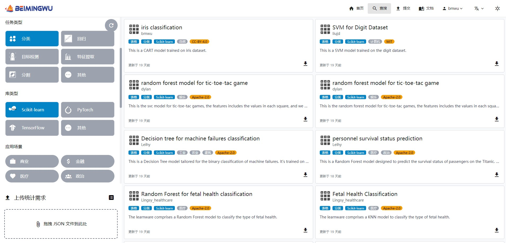

# 快速上手

欢迎来到北冥坞：学件基座系统！下列内容将帮您快速体验系统，包含学件查搜与部署。


## 学件查搜

北冥坞中的学件既可以通过语义信息进行查搜，也可以通过统计信息进行查搜。

通过语义信息查搜时，您可以填写目标学件的信息，系统将在学件的名称和描述字段中进行查搜；你也可以通过标签进行筛选。



通过统计信息进行查搜时，您需要提交任务的统计信息。我们提供的工具将在保护您数据隐私的情况下在本地为您生成任务的近似统计信息。通过下列代码，您可以轻松生成任务的近似统计信息。

```python
from learnware.specification import generate_stat_spec

data_type = "table" # 数据类型范围: ["table", "image", "text"]
spec = generate_stat_spec(type=data_type, X=test_x)
spec.save("stat.json")
```

通过上传统计信息的json文件，系统会匹配统计信息接近的学件。您可以通过学件卡片左下角的下载按钮进行学件zip包的下载。


某些情况下，多个学件组合在一起的统计信息会更加接近您的任务，系统会将这些学件打包推荐给您。您可以通过右上角的“下载全部”按钮进行一键下载。


## 学件部署

下载学件后，您本地的环境可能并不适配下载的学件，但您可通过我们提供的 `learnware` 包快速部署。例如下述代码将为学件自动构建相应的 `conda` 环境，使学件可以在您的设备上正常使用。

```python
from learnware.client import LearnwareClient

# 自动构建 conda 环境来加载学件
client = LearnwareClient()
leanrware = client.load_learnware(
    learnware_path=learnware_zip_path, runnable_option="conda"
)

# 使用学件对数据进行预测
pred_y = learnware.predict(test_x)
```